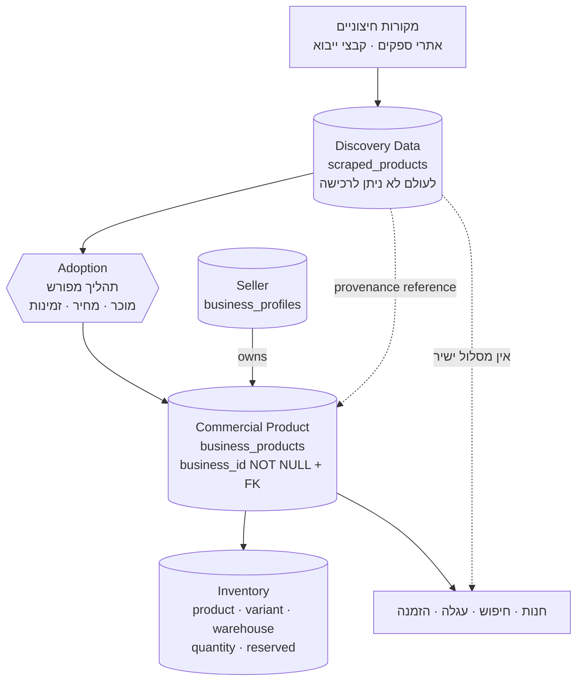
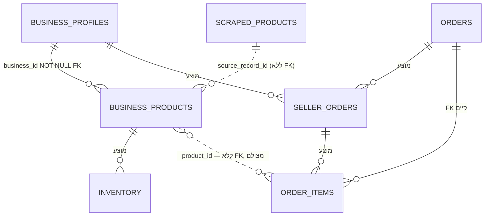
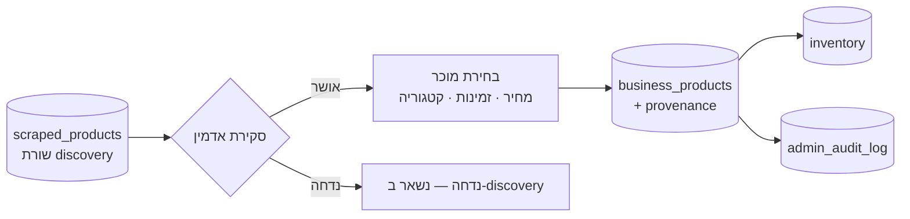

# Canonical Commerce Catalog — Mipo

תכנון הקטלוג הקנוני בעקבות `CD-01` (Marketplace) ו-`CD-02` (Option A —
`scraped_products` הוא staging בלבד).

**אין כאן שינוי קוד ואין שינוי סכמה.** זהו מסמך תכנון.

---

## 1. דוח אודיט — מה נמצא

### 1.1 ספירת אזכורים

| מונח | אזכורים ב-`server/src` |
|---|---|
| `business_products` | 20 |
| `scraped_products` | 13 |
| `product_source` | 4 |
| `DEFAULT_BUSINESS_ID` | **1** — fallback יחיד ב-`createProduct` |
| `commission_rate` | **0** |
| `supplier_link` | **0** |

### 1.2 הממצא המכריע — הזמנות אינן תלויות בקטלוג

```
order_items
  product_id      uuid      NULL      ← ללא FOREIGN KEY
  product_source  text      NULL      ← 'manual' | 'scraped'
  product_name    text      NOT NULL  ← מצולם
  product_image   text                ← מצולם
  price           numeric   NOT NULL  ← מצולם
  sku, weight, weight_unit, variant, size  ← מצולמים
```

**האילוצים היחידים על `order_items`:** מפתח ראשי, FK ל-`orders`, ו-
`CHECK (quantity > 0)`. **אין FK למוצר.**

**ואומת:** אף שאילתת קריאת הזמנה אינה עושה JOIN לטבלאות המוצרים.
`mapOrderItem` מחזיר 14 מפתחות, כולם מהשורה עצמה.

**המשמעות:** פריט הזמנה הוא רשומה עצמאית. שינוי, הסתרה או הסרה של שורת קטלוג
**אינם יכולים לשבור הזמנה היסטורית.** זה מה שהופך את כל המעבר לבטוח.

### 1.3 מסלולי מוצרים

| מסלול | הערה |
|---|---|
| `GET /api/products` | מחזיר את **שתי** הטבלאות, ללא `LIMIT` |
| `GET /api/categories` | עץ קטגוריות |
| `POST /api/products` | אדמין. `business_id` עם fallback ל-`defaultBusinessId` |
| `PATCH` / `DELETE /api/products/:id` | מקבלים `body.source` להכרעה בין הטבלאות |
| `PATCH` / `DELETE /api/products/bulk` | פעולות אצווה |
| **`GET /api/products/:id`** | **לא קיים** — דף המוצר נשען על הרשימה |

### 1.4 בעלות היום

| טבלה | בעלות |
|---|---|
| `business_products` | `business_id NOT NULL` + `FK → business_profiles(id) ON DELETE CASCADE` |
| `scraped_products` | **אין עמודת בעלות כלל** — לא business, לא seller, לא supplier, לא vendor |

### 1.5 העגלה עיוורת למקור

`CartItem` מחזיק `productId` ו**אין בו שדה מקור**. ה-checkout שולח
`product_id` בלבד, כך שהשרת נכנס לענף הדו-משמעי של `resolveCatalogOrderItem`
— שמריץ שתי שאילתות ומחזיר **409** אם אותו מזהה קיים בשתי הטבלאות.

תחת Option A זה נעשה פשוט יותר: יש רק טבלה אחת לפתור מולה.

### 1.6 שני תקדימי אימוץ שכבר קיימים בקוד

הקוד כבר יודע לעשות "דבר חיצוני הופך לשלנו, עם provenance":

| תקדים | מנגנון |
|---|---|
| **תמונות** | `adoptProductImage` + `image_source_url` + `image_adopted_at` |
| **קטגוריות** | `product_category_aliases` — אימוץ ערך קטגוריה שמסווג את המוצרים שנושאים אותו |

**אימוץ הקטלוג צריך לחקות את הדפוס הזה ולא להמציא חדש.**

---

## 2. עשר השאלות הנדרשות — תשובות

### Q1 · האם `scraped_product` קיים יכול כבר להיות מופנה מהזמנה קיימת?
**כן, מבנית.** `order_items.product_source` מקבל `'scraped'`, ו-
`resolveCatalogOrderItem` כולל מסלול `findScraped` שפותר מוצר שנקצר להזמנה.

**כמה הזמנות בפועל מפנות לכזה — לא אומת.** אין גישה לנתוני פרודקשן. זו
השאילתה הראשונה שצריך להריץ, והיא במסמך למטה.

### Q2 · האם `business_product` יכול להיות מופנה מהזמנה קיימת?
**כן.** `product_source = 'manual'`, אותו מנגנון.

### Q3 · האם מזהי המוצרים ייחודיים גלובלית בין שתי הטבלאות?
**מעשית כן, פורמלית לא.** שתיהן משתמשות ב-`gen_random_uuid()`, כך שהסתברות
ההתנגשות זניחה (~2⁻¹²²) — **אבל שום אילוץ אינו מונע את אותו UUID בשתיהן.**

הראיה שהמחבר שקל זאת: `resolveCatalogOrderItem` מחזיר **409 במפורש** כאשר
מזהה נפתר בשתי הטבלאות. הקוד מתגונן מפני מצב שהסכמה לא מונעת.

### Q4 · האם ניתן לאמץ מוצר בלי לשנות הפניות הזמנה קיימות?
**כן — וזו התשובה החשובה ביותר במסמך.**

אין FK מ-`order_items` למוצר, כל שדות התצוגה מצולמים, ואף קריאת הזמנה אינה
עושה JOIN. **הקטלוג וההזמנות ההיסטוריות מנותקים לחלוטין.** אימוץ, הסתרה או
אפילו מחיקת שורת קטלוג לא יכולים לשבור הזמנה.

### Q5 · מהי אסטרטגיית ההגירה הבטוחה ביותר?
**אדיטיבית בלבד.** לא להזיז שורות, לא למחוק, לא להקצות מחדש.

1. להוסיף עמודות provenance ל-`business_products`
2. **להפסיק לחשוף `scraped_products` כניתן לרכישה** — שינוי קריאה, לא נתונים
3. להשאיר את `scraped_products` בדיוק כפי שהיא
4. לבנות את זרימת האימוץ
5. להסיר את ה-fallback של `defaultBusinessId` **אחרי** שיש מוכר אמיתי

אף שלב אינו הורס נתונים, וכל שלב הפיך.

### Q6 · האם הקטלוג הקנוני צריך לשמר רשומות מקור?
**כן.** `scraped_products` נשארת כמות שהיא — היא **רשומת ה-provenance**.
זהו בדיוק הדפוס של `image_source_url`/`image_adopted_at` שכבר קיים.

### Q7 · מה להעתיק ומה להפנות?

| | |
|---|---|
| **להעתיק** | כל מה שמסחרי ואסור לו לנוע: מחיר, שם, תיאור, משקל, SKU — כפי שהיו **בזמן האימוץ** |
| **להפנות** | מזהה שורת המקור, בלבד |

הנימוק זהה לזה של `mapOrderItem`: ערך מסחרי שמוצג ללקוח חייב להיות מצולם,
אחרת שינוי במקור משכתב את מה שהוצג.

### Q8 · איך לייצג מחיר ומלאי?

**מחיר** — על המוצר המסחרי, כלומר לפי מוכר. שני מוכרים שמוכרים את אותו פריט
הם שתי שורות מסחריות עם אותה רשומת provenance.

**מלאי** — **ישות נפרדת**, לא עמודה:

```
inventory(product_id, variant_id, warehouse_id, quantity, reserved)
```

עמודת כמות על המוצר תחסום גם מוכרים מרובים וגם מחסנים, ושניהם ב-`CD-01`.
היום המלאי בוליאני (`CRIT-01`) — אין מה להפחית.

### Q9 · איך לאכוף בעלות מוכר?
**מבנית, כפי שכבר נעשה.** `business_products.business_id` הוא `NOT NULL` עם
FK. **להרחיב את אותו דפוס לכל ישות מסחרית חדשה** — מלאי, מבצעים, הזמנות-מוכר.

בנוסף: predicate שני בכל שאילתה מסחרית, לצד `user_id` הקיים.

**אסור** להסתמך על בדיקה ביישום בלבד. `NOT NULL` + FK הוא מה שהופך "לכל מוצר
יש מוכר" לטענה שבסיס הנתונים אוכף.

### Q10 · איך להבחין בין מוצר מאומץ לנתוני staging?
**לפי הטבלה, לא לפי דגל.**

- `scraped_products` = discovery. **לעולם לא ניתן לרכישה.**
- `business_products` = מסחרי. **תמיד יש מוכר**, כי העמודה `NOT NULL`.

דגל אפשר לשכוח לבדוק; טבלה נפרדת עם FK מחייב אי אפשר.

---

## 3. מודל הקטלוג הקנוני

### 3.1 העיקרון — לא ליצור הפשטה חדשה

אילוץ מפורש ב-brief: *"Do not add a new catalog abstraction merely to
duplicate the existing catalog."*

**`business_products` כבר היא הקטלוג המסחרי הקנוני.** יש לה בעלות מוכר חובה
עם FK. אין צורך בטבלה חדשה — צריך להשלים לה provenance ולהסיר ממנה את
ה-fallback.

### 3.2 ארבע השכבות



הקו המקווקו התחתון הוא מה שנסגר: **היום `scraped_products` מגיע לחנות ישירות.**

### 3.3 Provenance — עמודות מוצעות על הקטלוג המסחרי

בדפוס `image_source_url` / `image_adopted_at` שכבר קיים:

| עמודה | תפקיד |
|---|---|
| `source_kind` | `manual` · `scraped` · `import` |
| `source_record_id` | מזהה שורת ה-discovery. **ללא FK** — המקור עשוי להימחק ו-provenance שורד |
| `adopted_at` | מתי הפך למסחרי |
| `adopted_by` | איזה אדמין אימץ |
| `source_url` | כתובת המקור, כפי שהייתה באימוץ |

**למה ללא FK על `source_record_id`:** אותו נימוק כמו ב-`outbox_events.pet_id`
— רשומת provenance חייבת לשרוד את מחיקת המקור.

---

## 3A · שלושת הרבדים

`CQ-12` מחייב הבחנה מפורשת בין שלושה מושגים שהיום מעורבבים.

### רובד 1 — Discovery / Source Product

**`scraped_products`.** נתונים שנקלטו מאתר ספק או מקובץ ייבוא.

- אין בעלים, ולא יהיה לו.
- **לעולם אינו ניתן לרכישה.**
- אינו יוצר מוכר.
- הוא **רשומת ה-provenance** ונשמר כמות שהוא.
- אין להניח שלמוצר שנקצר יש בעלות חוקית או מסחרית כלשהי.

### רובד 2 — Canonical Commercial Product — *מושגי, לא פיזי*

הזהות המשותפת: "אותו פריט בעולם", שמוכר א' ומוכר ב' מוכרים שניהם.

**ההמלצה: לא לבנות את הרובד הזה כטבלה עכשיו.**

הנימוק כפול. ראשית, ה-brief אוסר במפורש להוסיף הפשטת קטלוג שנייה מתחרה.
שנית — ורציני יותר — רובד קנוני משותף פותח את **בעיית התאמת המוצרים**:
להכריע ששתי שורות של שני מוכרים הן אותו פריט. זו בעיה קשה בפני עצמה, היא
דורשת התאמה לפי ברקוד או GTIN שאין היום, וה-MVP אינו זקוק לה.

**בינתיים `source_record_id` הוא זהות המוצר הקנונית בפועל:** שתי רשומות
מסחריות שאומצו מאותה שורת discovery **הן** אותו מוצר, ואפשר לקבץ אותן בלי
טבלה נוספת.

**וזו בדיוק הסיבה ש-`UNIQUE(source_record_id)` אסור** — האילוץ הזה היה הופך
את שדה הקיבוץ לשדה בלעדיות, ואוסר את ריבוי המוכרים.

### רובד 3 — Seller-specific Commercial Listing

**`business_products`.** רשומת ההיצע של מוכר יחיד — וזה מה שהטבלה כבר היום.

| מאפיין | לכל מוכר בנפרד |
|---|---|
| מחיר | ✓ נעול באימוץ (`CD-06`) |
| זמינות ומלאי | ✓ |
| הגדרות שילוח | ✓ |
| תנאי עמלה | ✓ |
| תוכן ייחודי | ✓ |
| סטטוס | ✓ |

**בעלות נאכפת מבנית:** `business_id NOT NULL` + FK ל-`business_profiles`
עם `ON DELETE CASCADE`.

### מה נדרש כדי לקדם את רובד 2 לטבלה אמיתית

לא היום, אבל התנאי ראוי שיהיה רשום: **מזהה חיצוני יציב** — GTIN, EAN או
ברקוד יצרן. בלי אחד כזה, כל רובד קנוני משותף יישען על התאמת מחרוזות, וזה
מייצר קישורים שגויים בין מוצרים של מוכרים שונים.

---

## 3B · מפת הקשרים



| קשר | מצב |
|---|---|
| `business_profiles` → `business_products` | **קיים** — FK, `NOT NULL` |
| `scraped_products` → `business_products` | **מוצע** — `source_record_id`, **ללא FK** בכוונה: provenance חייב לשרוד מחיקת מקור |
| `business_products` → `inventory` | **מוצע** — `(product, variant, warehouse, quantity, reserved)` |
| `orders` → `seller_orders` → `order_items` | **מוצע** — היום `order_items` תלוי ישירות ב-`orders` |
| `business_products` ↛ `order_items` | **מכוון: ללא FK.** זה מה שמגן על ההיסטוריה |

**Mipo Shop אינו חריג במפה הזו** — הוא שורה ב-`business_profiles` ככל מוכר.

---

## 4. דוח תאימות לנתונים קיימים

| # | נבדק | תוצאה |
|---|---|---|
| 1 | FK מ-`order_items` למוצר | **אין** |
| 2 | JOIN מקריאת הזמנה לקטלוג | **אין** |
| 3 | שדות תצוגה בפריט הזמנה | **מצולמים** — 14 מפתחות |
| 4 | בעלות על `business_products` | `NOT NULL` + FK ✅ |
| 5 | בעלות על `scraped_products` | **אין** ❌ |
| 6 | `DEFAULT_BUSINESS_ID` | נקודה **אחת** |
| 7 | מזהים ייחודיים בין הטבלאות | מעשית כן, פורמלית לא |
| 8 | מקור בעגלה | **לא נשמר** |

**מסקנה: אף הזמנה קיימת לא יכולה להישבר משינוי בקטלוג.** זו לא הערכה — זו
תוצאה של היעדר FK והיעדר JOIN, ושניהם אומתו.

### אימות מול פרודקשן — חובה לפני כל מיגרציה

**אין להסיק שההגירה בטוחה מבדיקת סכמה בלבד.** ארבע שאילתות קריאה. **התוצאות
טרם סופקו — כולן `PENDING`. אין להמציא תוצאות.**

```sql
-- PQ-1 · פילוח פריטי ההזמנה לפי מקור
SELECT
  product_source,
  COUNT(*) AS order_item_count
FROM public.order_items
GROUP BY product_source
ORDER BY product_source;
```

```sql
-- PQ-2 · האם קיים מזהה בשתי הטבלאות (Q3 אמפירית)
SELECT
  b.id AS business_product_id,
  s.id AS scraped_product_id
FROM public.business_products b
JOIN public.scraped_products s
  ON s.id = b.id;
```

```sql
-- PQ-3 · כמה מוצרים שנקצרו נמכרו אי פעם
SELECT
  COUNT(DISTINCT product_id) AS scraped_product_ids_in_orders
FROM public.order_items
WHERE product_source = 'scraped';
```

```sql
-- PQ-4 · פריטי הזמנה ללא מקור רשום
SELECT
  COUNT(*) AS missing_product_source_count
FROM public.order_items
WHERE product_source IS NULL;
```

| # | מה נקבע לפי התוצאה | סטטוס |
|---|---|---|
| PQ-1 | היקף המוצרים שנקצרו בהזמנות → עלות M-3/M-4 | **PENDING** |
| PQ-2 | האם ייחודיות המזהים מופרת בפועל | **PENDING** |
| PQ-3 | כמה מוצרי discovery נמכרו | **PENDING** |
| PQ-4 | **פריטים שלא ניתן לייחס למקור** — עמודה nullable | **PENDING** |

**PQ-4 חשובה במיוחד ולא הייתה ברשימה שלי קודם.** `product_source` הוא
nullable. פריט הזמנה ישן עשוי לא לשאת מקור כלל, ואז לא ניתן לדעת מאיזו טבלה
הוא הגיע. אם המספר גדול, PQ-1 אינה מספרת את כל הסיפור.

---

## 4A · תאימות היסטורית — חמש הראיות

`CD-02` כלל 9 דורש שהזמנות ונתונים היסטוריים לא יישברו. **זו אינה הבטחה —
אלה חמש עובדות מבניות שאומתו מול הסכמה החיה.**

| # | עובדה | ראיה |
|---|---|---|
| 1 | **`order_items.product_id` הוא nullable** | `information_schema` — `is_nullable = YES` |
| 2 | **אין FK מ-`order_items` לקטלוג** | `pg_constraint` — שלושה אילוצים בלבד: PK, FK ל-`orders`, `CHECK (quantity > 0)` |
| 3 | **`product_source` רושם את המקור** | עמודה קיימת, מקבלת `manual` / `scraped` |
| 4 | **שדות ההזמנה מצולמים** | `product_name` (`NOT NULL`), `product_image`, `price`, `sku`, `weight`, `weight_unit`, `variant`, `size` |
| 5 | **קריאת הזמנה אינה עושה JOIN לקטלוג** | `mapOrderItem` מחזיר 14 מפתחות, כולם מהשורה. אף שאילתת הזמנה אינה מצרפת טבלת מוצרים |

**המסקנה שנובעת:** פריט הזמנה מרונדר במלואו בלי לגעת בקטלוג. הסרת
`scraped_products` מהחנות ומפתרון ההזמנה אינה יכולה לשנות הזמנה שכבר בוצעה.

**הסייג:** עובדה 3 תלויה בכך ש-`product_source` אכן מולא. הוא **nullable** —
ולכן `PQ-4` נדרשת. אם קיימים פריטים ללא מקור, לא ניתן לייחס אותם לטבלה, וזה
משנה את מה ש-`PQ-1` מספרת.

---

## 5. תוכנית הגירה

**כל שלב אדיטיבי והפיך. אין מחיקה, אין הזזה, אין הקצאה מחדש.**

| שלב | מה | סיכון | הפיך |
|---|---|---|---|
| **M-0** | להריץ את שלוש השאילתות | אפס — קריאה | — |
| **M-1** | להוסיף 5 עמודות provenance ל-`business_products`, כולן nullable | אפס | כן |
| **M-2** | למלא `source_kind='manual'` לשורות קיימות | אפס | כן |
| **M-3** | **להסיר את `scraped_products` מ-`listProducts`** | 🟡 החנות מציגה פחות מוצרים | כן — שינוי קריאה |
| **M-4** | להסיר את מסלול `findScraped` מ-`resolveCatalogOrderItem` | 🟡 עגלות פתוחות לפריט שנקצר ייכשלו | כן |
| **M-5** | לבנות זרימת אימוץ באדמין | אפס — תוספת | כן |
| **M-6** | ליצור את Mipo Shop כמוכר רגיל | אפס | כן |
| **M-7** | להסיר את fallback `defaultBusinessId` | 🟡 יצירת מוצר בלי `business_id` תיכשל | כן |
| **M-8** | ישות `inventory` | 🟡 שינוי מודל | כן |

**M-3 ו-M-4 יחד הם הרגע שבו ההחלטה נכנסת לתוקף.** לפניהם — הכל תוספות בלבד.

**סיכון שיש לטפל בו ב-M-4:** לקוח עם עגלה ב-`localStorage` המכילה מוצר שנקצר
יקבל כישלון ב-checkout. **נדרשת הודעה ברורה** ולא 400 גנרי — העגלה נשמרת
בדפדפן ויכולה להיות בת שבועות.

---

## 6. תוכנית אכיפת בעלות

| רובד | מנגנון |
|---|---|
| **סכמה** | `business_id NOT NULL` + FK — **קיים**. להרחיב לכל ישות מסחרית חדשה |
| **כתיבה** | `business_id` מגיע מהקשר המוכר המאומת, **לעולם לא מגוף הבקשה** |
| **קריאה** | predicate מוכר בכל שאילתה מסחרית, לצד `user_id` |
| **הרשאות** | תפקידי Seller נפרדים מ-Admin |
| **ביקורת** | כל שינוי בעלות ל-`admin_audit_log` |

**אנטי-דפוס שאסור לחזור עליו:** `defaultBusinessId` הוא fallback שקט שממציא
בעלות. הוא הוסר ב-M-7 ואין להחזירו בשום צורה.

---

## 7. זרימת האימוץ



**כללים:**

1. אימוץ הוא **מפורש**. אין אימוץ אוטומטי, אין אימוץ בתזמון.
2. האימוץ **חייב** לקבוע מוכר. בלי מוכר אין מה לאמץ — העמודה `NOT NULL`.
3. שורת ה-discovery **נשארת** ואינה משתנה.
4. ערכים מסחריים **מצולמים** בזמן האימוץ.
5. כל אימוץ נרשם ל-`admin_audit_log`.
6. אותה שורת discovery יכולה להיות מאומצת בידי **כמה מוכרים** — זה Marketplace.

---

## 8. שאלות פתוחות הדורשות החלטה עסקית

| # | שאלה | למה חוסם |
|---|---|---|
| **CQ-11** | מה קורה לפריטי הזמנה קיימים עם `product_source='scraped'`? | תלוי בתוצאת שאילתה 1 |
| **CQ-12** | האם אותו מוצר שנקצר יכול להיות מאומץ בידי כמה מוכרים? | קובע אם `source_record_id` ייחודי |
| **CQ-13** | מי מאשר אימוץ — אדמין בלבד, או גם מוכר לקטלוג שלו? | קובע את מודל ההרשאות |
| **CQ-14** | האם המחיר המאומץ נעול, או מתעדכן מהמקור? | **המלצה: נעול.** מחיר שזז לבד הוא מחיר שאיש לא אישר |
| **CQ-15** | מה קורה כששורת discovery מתעדכנת אחרי אימוץ? | המלצה: התראה לאדמין, לא עדכון אוטומטי |
| **CQ-16** | האם מוכר חיצוני יכול לקצור לקטלוג שלו? | משפיע על הרשאות ועל `urlSafety` |

---

## נספח — מה לא אומת

- **תוכן פרודקשן.** אין גישה. שלוש השאילתות בסעיף 4 חייבות לרוץ שם.
- **היקף `scraped_products`** בפועל — לא ידוע כמה שורות ואיזה חלק מהקטלוג.
- **n8n** — מוגדר בסשן ונכשל בחיבור; צינור הייבוא לא נבדק מקצה לקצה.

---

## 9. השלב הבא — `Canonical Catalog Migration Plan`

**לא בוצע. מוצע בלבד.** נדרש אישור מפורש ותוצאות `PQ-1`…`PQ-4` לפני התחלה.

### תנאי כניסה

| # | תנאי | סטטוס |
|---|---|---|
| E-1 | `PQ-1`…`PQ-4` הורצו והתוצאות סופקו | ⛔ **PENDING** |
| E-2 | `CD-03` (עמלות) הוכרע | ⛔ פתוח |
| E-3 | `CD-04` (תשלומים למוכרים) הוכרע | ⛔ פתוח |
| E-4 | `CQ-13` — מי מאשר אימוץ | ⛔ פתוח |
| E-5 | אישור מפורש לשינוי סכמה | ⛔ ממתין |

### תוכן השלב

1. **M-1** מיגרציה אדיטיבית — 5 עמודות provenance, כולן nullable
2. **M-2** מילוי `source_kind='manual'` לשורות קיימות
3. **M-5** זרימת אימוץ באדמין
4. **M-6** Mipo Shop כמוכר רגיל
5. **M-3 + M-4** הסרת `scraped_products` מהרשימה ומפתרון ההזמנה — **הרגע שבו ההחלטה נכנסת לתוקף**
6. **M-7** הסרת fallback `defaultBusinessId`
7. אילוץ `UNIQUE (business_id, source_kind, source_record_id)` — **רק לאחר `PQ-2`**

### מה השלב הזה אינו כולל

מלאי כישות (`M-8`), `seller_orders`, עמלות, תשלומים, RBAC של מוכרים. כל אחד
מהם שלב נפרד עם אישור נפרד.
