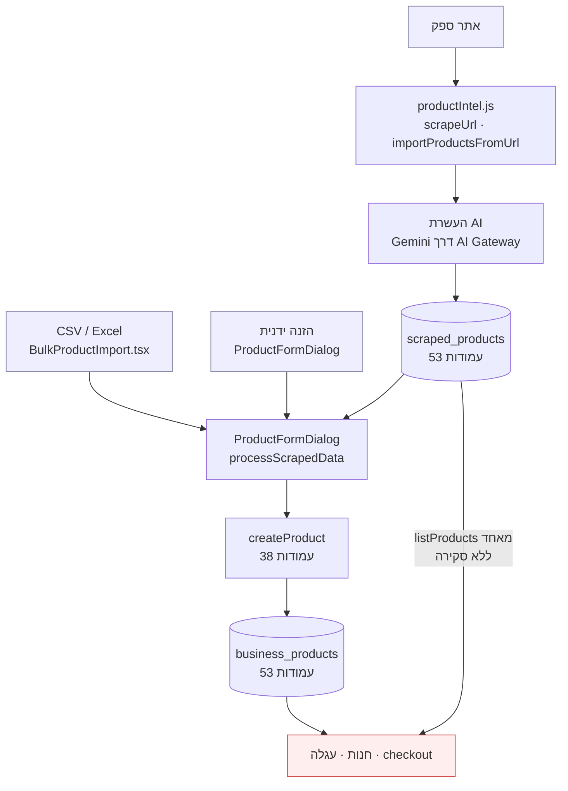
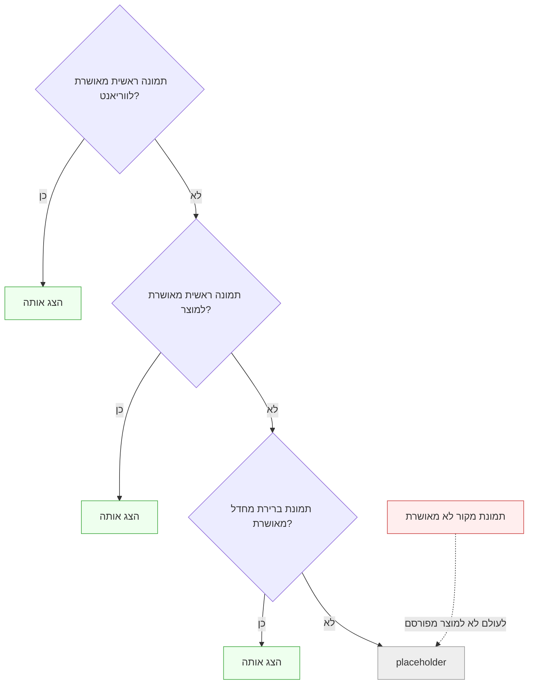
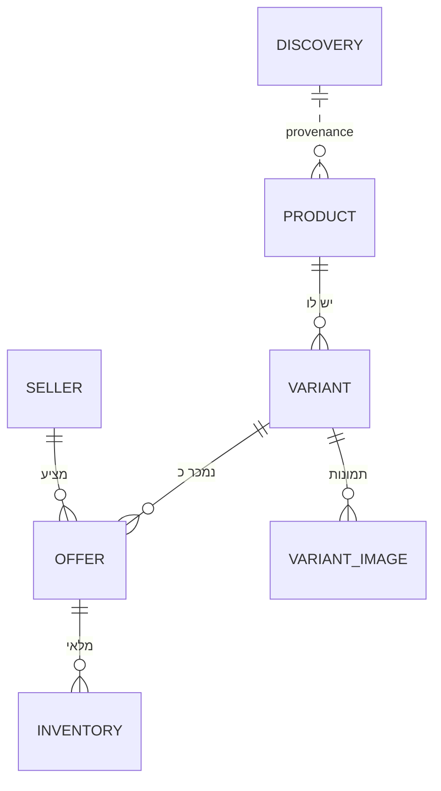
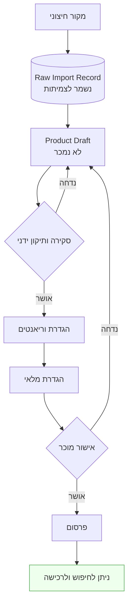

# Product Intake & Variant Architecture — Audit

אודיט של תהליך קליטת המוצרים ומודל הווריאנטים בפועל.

**אין כאן שינוי קוד, שינוי סכמה, מיגרציה או עדכון נתונים.**

נכון ל-2026-09-14 · קצה פרודקשן `1a5246ea`

---

## 1. ממצאי מצב קיים

### 1.1 חמשת הממצאים המרכזיים

| # | ממצא | חומרה |
|---|---|---|
| **I-01** | **אין סטטוס פרסום כלל.** 53 עמודות ב-`business_products`, ואף אחת אינה `status`, `published`, `is_active`, `draft` או `visibility` | 🔴 |
| **I-02** | **דגלי הסקירה קיימים ואינם חוסמים כלום.** `needs_image_review` ו-`needs_price_review` משמשים **רק כטאב סינון במסך האדמין**. `listProducts` אינו מסנן לפיהם — **מוצר המסומן "דורש בדיקת תמונה" נמכר עכשיו** | 🔴 |
| **I-03** | **`product_variations` היא טבלה מתה** — אפס אזכורים ביישום | 🔴 |
| **I-04** | **גם אילו הייתה חיה, היא לא יכולה לייצג וריאנט רב-ממדי** — שורה אחת = זוג `name`/`value` יחיד | 🔴 |
| **I-05** | **בחירת התמונה היא לפי סדר איסוף, הראשון זוכה.** אין דירוג, אין ניקוד, אין אימות שהתמונה שייכת למוצר | 🔴 |

### 1.2 האזכורים לטבלה המתה

```
server/src/productIntel.js:353   $("[data-product_variations]").attr(...)
server/src/productIntel.js:481   "[data-product_variations]"
```

**שני האזכורים אינם לטבלה.** הם למאפיין HTML של WooCommerce בדף שנקצר — מחרוזת
שחולקת את השם במקרה. **לטבלת `product_variations` אפס אזכורים ביישום.**

---

## 2. זרימת הנתונים הנוכחית



**הקו התחתון הוא הבעיה:** `scraped_products` מגיע לחנות **בלי לעבור את הטופס
ובלי סקירה.** זה מה ש-`CD-02` סוגר.

**ואין שער בשום מקום בזרימה.** מרגע ש-`createProduct` רץ, המוצר נמכר.

---

## 3. מיפוי הסכמה — ששת המושגים

`business_products` **מייצגת שילוב: Seller-owned commercial listing שמכיל בתוכו
גם Product וגם Variant.** זו התשובה המפורשת שביקשת.

הראיה: על **אותה שורה** יושבים

- זהות מוצר — `name`, `description`, `brand`, `category_id`
- ממדי וריאנט — `weight`, `weight_unit`, `flavors[]`, `dog_size`, `life_stage`
- מסחר של מוכר — `price`, `sku`, `in_stock`, `cost_price`, `commission_rate`
- בעלות — `business_id`

**שורה אחת אינה יכולה לייצג קולר בשלושה גדלים ושני צבעים.** היא מייצגת צירוף
אחד, ולכן כל צירוף מחייב שורה נפרדת — עם שם, תיאור ותמונה משוכפלים.

| מושג | ייצוג היום | מצב |
|---|---|---|
| **Product** | ללא ישות. נגזר משדות על השורה המסחרית | ❌ חסר |
| **Variant** | ארבעה מנגנונים מקבילים, אף אחד לא עובד | 🔴 שבור |
| **Seller Offer** | `business_products` — זה כן קיים | ✅ |
| **Inventory** | `in_stock` בוליאני. אין כמות | 🔴 |
| **Supplier** | `supplier_id` **ללא FK**, ואין טבלת `suppliers` | ❌ לא קיים |
| **Discovery** | `scraped_products` | ✅ קיים, אך ניתן לרכישה |

### 3.1 ארבעת מנגנוני הווריאנט

| # | מנגנון | מבנה | בשימוש? |
|---|---|---|---|
| 1 | `product_variations` | `variation_name` + `variation_value` + מחיר + SKU | **לא — טבלה מתה** |
| 2 | `business_products.flavors` | `text[]` | כן |
| 3 | `business_products.product_attributes` | `jsonb` | כן |
| 4 | `scraped_products.variants` + `sizes`/`colors`/`flavors` | `jsonb` + מערכים | כן, בקליטה |

**למה אף אחד לא פותר את הדוגמאות שלך:**

- **מנגנון 1** מחזיק **זוג אחד לשורה**. "מידה S, כחול" הוא שתי שורות נפרדות
  ללא שום קישור ביניהן לצירוף אחד שניתן לקנות. **רב-ממדיות בלתי אפשרית מבנית.**
- **מנגנון 2** הוא מערך טעמים בלי מחיר ובלי SKU — לא ניתן לתמחר "כבש 1.5 ק״ג"
  בנפרד מ"כבש 3 ק״ג".
- **מנגנון 3** הוא jsonb תיאורי, ללא זהות וללא מסחר.
- **מנגנון 4** הוא נתוני קליטה גולמיים.

---

## 4. בעיות הייבוא

| # | בעיה | ראיה |
|---|---|---|
| IM-1 | **אין שער פרסום** | אין עמודת סטטוס. `createProduct` = מוצר נמכר |
| IM-2 | **דגלי סקירה אינם חוסמים** | `AdminProducts.tsx:648` — טאב סינון בלבד |
| IM-3 | **`scraped_products` עוקף את הטופס** | `listProducts` מאחד את שתי הטבלאות |
| IM-4 | **אין צעד אישור** | אין `approved_by`, אין `approved_at` |
| IM-5 | **טקסט AI אינו מסומן כלא-מאומת** | היוריסטיקה יחידה: `needs_review: !product.ingredients` |
| IM-6 | **וריאנטים נוצרים ידנית כשורות נפרדות** | אין מנגנון חי |

---

## 5. בעיות התמונות — האבחון

### 5.1 סדר האיסוף, והראשון זוכה

`productIntel.js` אוסף תמונות לפי סדר הקוד, ו-`images[0]` הופך לתמונה הראשית:

```
1. JSON-LD  jsonProduct.image[]
2. og:image                       ← לרוב תמונת שיתוף של האתר, לא של המוצר
3. [data-large_image]
4. [data-zoom-image]
5. .woocommerce-product-gallery img, .product-gallery img, img.wp-post-image
```

**אין דירוג, אין ניקוד, אין בדיקה שהתמונה שייכת למוצר הזה.**

### 5.2 חמש הסיבות לתמונה שגויה

| # | סיבה |
|---|---|
| **IMG-1** | **`og:image` שני בסדר.** בהיעדר JSON-LD, באנר כלל-אתרי מנצח |
| **IMG-2** | **הסלקטורים רחבים.** `.product-gallery img` תופס גם קרוסלת "מוצרים דומים" |
| **IMG-3** | **הסדר הוא מקור, לא איכות.** הראשון שנמצא הוא הראשי |
| **IMG-4** | **הסרת סיומת גודל עלולה לשבור.** `-300x300.jpg` → `.jpg` מניח שהקובץ המלא קיים באותו נתיב. ב-CDN שמגיש רק גדלים — 404 |
| **IMG-5** | **חסימה לפי מחרוזת.** `logo\|favicon\|icon\|payment\|avatar\|whatsapp` — באנר ב-`/uploads/banner.jpg` עובר, ומוצר שנקרא "icon" נחסם |

### 5.3 מה כן קיים ונכון

`adoptProductImage` **מאמץ את הבייטים** ושומר `image_source_url` +
`image_adopted_at`. **זה הדפוס הנכון** — הוא רק מופעל על בחירה שאיש לא אישר.

### 5.4 מה חסר

אין תמונה לכל וריאנט · אין סימון מפורש של הנבחרת · אין דירוג · אין טיפול
בכפילויות מעבר ל-URL זהה · אין הגנה מפני דריסת תמונה מאושרת.

### 5.5 זרימת תמונות מוצעת

1. **לשמר את כל תמונות המקור** — טבלה, לא מערך
2. **לסמן את הנבחרת במפורש** — `is_primary`, לא מיקום במערך
3. **תיקון ידני** — אדמין בוחר, והבחירה **ננעלת**
4. **לשמר `source_url` ו-`adopted_at`** — כבר קיים
5. **לא לדרוס תמונה מאושרת בשקט** — קציר חוזר מציע, לא מחליף
6. **אימות לפני פרסום** — `needs_image_review` הופך לשער אמיתי


---

## 5A · תמונות ברמת הווריאנט

דרישה שנוספה 2026-09-14. נבדקה מול הסכמה החיה.

### 5A.1 הממצא — טבלת תמונות מתה, מחוברת לצד הלא נכון

```
product_images
  id             uuid  NOT NULL
  product_id     uuid          ← FOREIGN KEY → scraped_products(id) ON DELETE CASCADE
  image_url      text  NOT NULL
  alt_text       text
  is_main        boolean
  display_order  integer
  created_at     timestamptz
```

**שני דברים חריפים:**

1. **אפס אזכורים בקוד.** כמו `product_variations` — טבלה מנורמלת שנייה שאיש
   אינו משתמש בה.
2. **ה-FK מצביע ל-`scraped_products`.** טבלת התמונות המנורמלת היחידה מחוברת
   ל**שכבת ה-discovery**, לא לקטלוג המסחרי. הצד המסחרי מחזיק תמונות
   כ-`image_url` + `images[]` — מערך, לא ישות.

### 5A.2 עשרת השדות הנדרשים — קיים מול חסר

| שדה | מצב | הערה |
|---|---|---|
| `image_id` | ⚠️ **בטבלה מתה** | `product_images.id` |
| `product_id` | ⚠️ **מצביע לא נכון** | FK ל-`scraped_products`, לא לקטלוג המסחרי |
| `variant_id` | ❌ **חסר** | אין ישות וריאנט כלל |
| `source_url` | ⚠️ **חלקי** | `business_products.image_source_url` — **אחד למוצר, לא אחד לתמונה** |
| `image_source` | ❌ **חסר** | איזה סלקטור מצא אותה — `og:image`? גלריה? JSON-LD? |
| `is_primary` | ⚠️ **בטבלה מתה** | `is_main`. בצד המסחרי הראשיות היא **מיקום במערך** |
| `sort_order` | ⚠️ **בטבלה מתה** | `display_order` |
| `approval_status` | ❌ **חסר** | — |
| `approved_at` | ⚠️ **קיים בשם, לא במשמעות** | ראה למטה |
| `approved_by` | ❌ **חסר** | — |

**שתיים מתוך עשר קיימות כראוי, ושתיהן בטבלה מתה.**

### 5A.3 ההבחנה הקריטית — אימוץ אינו אישור

`image_adopted_at` נראה כמו `approved_at` **והוא אינו.**

`adoptProductImage` מעתיק את **הבייטים** לאחסון שלנו, כדי שהקטלוג לא יישבר
כשהספק מוחק קובץ. הוא **אינו אומר שאדם בדק שהתמונה נכונה.**

```
image_adopted_at  =  העתקנו את הקובץ           ← אוטומטי
approved_at       =  אדם אישר שזו התמונה הנכונה  ← לא קיים
```

**היום כל תמונה "מאומצת" ואף תמונה אינה "מאושרת".** אם `image_adopted_at`
ישמש כסטטוס אישור, כל תמונה שגויה שנקצרה תיחשב מאושרת ברגע ההעתקה.

### 5A.4 היררכיית התמונות הנדרשת

| רובד | תפקיד | מצב |
|---|---|---|
| **Product-level** | תמונות משותפות, אווירה, כלליות, רלוונטיות לכמה וריאנטים | ⚠️ קיים כמערך שטוח ללא סיווג |
| **Variant-level** | וריאנט מדויק — אריזה, צבע, מידה, טעם, משקל, נפח | ❌ **לא קיים** |
| **Seller Offer-level** | — | **האודיט אינו מוכיח שנדרש** |

**על רובד ההצעה — המסקנה מהראיות:** לא נמצאה בקוד ולא בסכמה שום אינדיקציה
שמוכר זקוק לתמונה משלו לאותו וריאנט. `CD-06` נועל את **המחיר** לכל מוכר, לא
את המראה. **המלצה: לא לבנות את הרובד הזה כעת** — הצורך האמיתי (תמונה של
האריזה של המוכר) אינו מוכח. להשאיר כשאלה פתוחה.

### 5A.5 התנהגות נדרשת בבחירת וריאנט

בבחירת וריאנט יש לעדכן: **תמונה ראשית · גלריה · SKU · מחיר · זמינות · מצב
מלאי · מאפייני הווריאנט המדויקים.**

**היום אף אחד מהשבעה אינו אפשרי** — אין ישות וריאנט, ו-`CartItem` מחזיק
`variant?: string` כמחרוזת חופשית.

### 5A.6 סדר עדיפות לפתרון תמונה



**כלל מוחלט: לא להציג תמונת מקור לא מאושרת במוצר מפורסם.** כדי לאכוף אותו
נדרש `approval_status`, ואין.

### 5A.7 דרישות ייבוא ואימוץ

| # | דרישה | מצב |
|---|---|---|
| 1 | לשמר את **כל** תמונות המקור | ⚠️ `images[]` שומר, אך ללא מטא-דאטה לכל תמונה |
| 2 | תמונות שונות לווריאנטים שונים | ❌ |
| 3 | החלפה ידנית של תמונה שגויה | ⚠️ אפשרי דרך עריכה, בלי מעקב |
| 4 | לשמר provenance | ⚠️ **אחד למוצר**, לא לכל תמונה |
| 5 | **לא לדרוס תמונה מאושרת בשקט** | ❌ **אין מושג של אישור** |
| 6 | אישור תמונה ברמת וריאנט | ❌ |
| 7 | נפילה לתמונת מוצר רק בהיעדר תמונת וריאנט מאושרת | ❌ |

### 5A.8 מה נדרש מבנית

**ישות תמונה אחת** שמצביעה ל**מוצר או לווריאנט**, נושאת provenance לכל תמונה
(`source_url` + `image_source` — איזה סלקטור מצא אותה), ומפרידה בין **אימוץ**
(הועתק) לבין **אישור** (אדם בדק).

`product_images` היא נקודת פתיחה סבירה במבנה — **אבל ה-FK שלה מצביע לצד
הלא נכון, וחסרים בה ארבעה שדות.** להרחיב, לא להמציא טבלה חמישית.

---

## 6. בעיות תיאור ומפרט

| רובד | מצב היום |
|---|---|
| **תיאור מקור גולמי** | `scraped_products.long_description`, `long_description_html` ✅ |
| **תיאור מנורמל** | ❌ אין |
| **תיאור מסחרי מאושר** | ❌ אין — `business_products.description` הוא העתק ללא סטטוס |
| **מפרט מובנה** | חלקית — `product_attributes` jsonb, נגזר מטבלת HTML |
| **Provenance** | `source_url` בלבד |
| **עריכות ידניות** | לא נבדלות מטקסט מיובא |
| **סטטוס אימות** | ❌ אין |

**IM-5 בפירוט:** ההעשרה מריצה Gemini ומסמנת `needs_review: !product.ingredients`
— כלומר "דורש סקירה" רק אם חסרים רכיבים. **טקסט שה-AI המציא בביטחון על מוצר
שכן יש לו רכיבים עובר בלי סימון.**

---

## 7. פערי וריאנטים

לא ניתן לייצג היום: ריבוי ממדים · צירוף כיחידה נקנית · מחיר לצירוף · SKU
לצירוף · מלאי לצירוף · תמונה לצירוף · סטטוס לצירוף.

### 7.1 המודל המוצע — היברידי

**מנורמל לזהות ולמסחר, גמיש לתיאור.** זה מה שביקשת, וזה גם הנכון.



| ישות | תפקיד | מנורמל |
|---|---|---|
| **Product** | זהות משותפת — שם, מותג, קטגוריה, תיאור מאושר | ✅ |
| **Variant** | צירוף נקנה. `variant_id` יציב, SKU, ברקוד, סטטוס | ✅ |
| **Variant attributes** | `(variant_id, dimension, value)` — **שורה לכל ממד** | ✅ |
| **Seller Offer** | מחיר, זמינות, עמלה — **לכל מוכר** | ✅ |
| **Inventory** | `quantity`, `reserved` לכל offer ומחסן | ✅ |
| **תיאור לא-קריטי** | jsonb | גמיש |

**למה טבלת מאפיינים ולא עמודות:** "מידה × צבע" ו"טעם × משקל" הם ממדים שונים
לגמרי. עמודות קבועות יחייבו מיגרציה לכל ממד חדש — וביקשת תמיכה ב**מאפיינים
עתידיים שרירותיים**.

**למה לא jsonb לכל הווריאנט:** מחיר, SKU, מלאי וסטטוס הם קריטיים למסחר וצריכים
אילוצים, אינדקסים ו-FK. jsonb לא נותן אותם.

### 7.2 שלוש הדוגמאות שלך במודל

```
Product: קולר לכלב
├─ Variant A: [size=S][color=blue]   SKU-S-BLU
├─ Variant B: [size=M][color=blue]   SKU-M-BLU
└─ Variant C: [size=S][color=red]    SKU-S-RED

Product: Royal Canin יבש
├─ Variant A: [flavor=lamb][weight=1.5kg]
├─ Variant B: [flavor=lamb][weight=3kg]
└─ Variant C: [flavor=chicken][weight=1.5kg]
```

לכל וריאנט **N שורות מאפיין** — ומכאן ריבוי הממדים.

---

## 8. פערי עגלה ו-checkout

`CartItem` מחזיק: `id` (זהות שורה), `productId`, `name`, `price`, `image`,
`quantity`, `variant?` (מחרוזת), `size?` (מחרוזת).

| נדרש | קיים? |
|---|---|
| product ID | ✅ |
| **variant ID** | ❌ — מחרוזת חופשית בלבד |
| **seller ID** | ❌ |
| **offer ID** | ❌ |
| **SKU** | ❌ |
| quantity | ✅ |
| **price snapshot** | ⚠️ קיים בעגלה, **מתעלמים ממנו** — `resolveCatalogOrderItem` פותר מחיר מהקטלוג |
| **מקור** | ❌ — ולכן ה-checkout תמיד בענף הדו-משמעי |

**התעלמות מהמחיר בעגלה היא נכונה** — היא מונעת זיוף מחיר. **לא לשנות.**

### 8.1 מה יצטרך להשתנות בעתיד — **לא עכשיו**

`CartContext.tsx` (מבנה + `localStorage`) · `ProductDetail` (בורר וריאנט) ·
`Checkout.tsx` (שליחת `variant_id`, `offer_id`) · `normalizeRequestedOrderItems` ·
`resolveCatalogOrderItem` (פתרון לפי offer) · `order_items` (עמודות חדשות) ·
`mapOrderItem`.

**עגלה ב-`localStorage` יכולה להיות בת שבועות** — כל שינוי מבנה חייב לקרוא
עגלות ישנות בלי לקרוס.

---

## 9. מודל הדומיין המוצע — שש הפרדות

| # | רובד | ישות | כלל |
|---|---|---|---|
| 1 | **Discovery** | `scraped_products` | לעולם לא נמכר, ללא בעלים |
| 2 | **Draft** | מוצר מסחרי ללא פרסום | קיים, **אינו נמכר** |
| 3 | **Approved Product** | זהות מאושרת | תיאור ומפרט שנסקרו |
| 4 | **Seller Offer** | הצעת מוכר | מחיר, עמלה, בעלות |
| 5 | **Variant** | צירוף נקנה | SKU, ברקוד, מאפיינים |
| 6 | **Inventory** | כמות | לכל offer ומחסן |

---

## 10. מחזור הקליטה המוצע



**כללים:** הנתונים הגולמיים נשמרים לצמיתות · **אין פרסום אוטומטי** · כל מעבר
נרשם ל-audit · דחייה מחזירה לטיוטה ואינה מוחקת.

---

## 11. כללי אימות מוצעים

**לפני פרסום — חובה:** מוכר תקף · שם · מחיר > 0 · תמונה **שנבחרה במפורש** ·
קטגוריה · לפחות וריאנט אחד · SKU לכל וריאנט · מלאי מוגדר ·
`needs_image_review = false` · `needs_price_review = false`.

**דורש סקירה:** טקסט שנוצר ב-AI · מחיר שחרג מסף · תמונה מ-`og:image` ·
מוצר ללא רכיבים · SKU כפול אצל אותו מוכר.

**I-02 הופך משער מדומה לשער אמיתי:** הדגלים כבר קיימים — צריך שיחסמו.

---

## 12. אסטרטגיית הגירה מוצעת

**אדיטיבי בלבד. לא בוצע.**

| שלב | מה | סיכון |
|---|---|---|
| V-1 | סטטוס פרסום, ברירת מחדל `published` לשורות קיימות | אפס — התנהגות זהה |
| V-2 | `listProducts` מסנן לפי סטטוס | אפס — הכל עדיין `published` |
| V-3 | טבלאות Product · Variant · VariantAttribute · Offer | אפס — ריקות |
| V-4 | Backfill: כל `business_product` → Product + וריאנט יחיד + Offer | 🟡 |
| V-5 | קריאה דרך המודל החדש | 🟡 |
| V-6 | UI וריאנטים באדמין | אפס |
| V-7 | בורר וריאנט ועגלה | 🔴 עגלות legacy |
| V-8 | `needs_*_review` חוסמים פרסום | 🟡 מוצרים מסומנים יירדו |

**V-1 קריטי וזול:** ברירת מחדל `published` = אפס שינוי התנהגות, ומאותו רגע יש
שער.

**`product_variations` המתה — לא למחוק בשלב הזה.** היא ריקה או כמעט ריקה, אבל
זה **לא אומת מול פרודקשן**.

---

## 13. סיכונים ו-Rollback

| סיכון | הפחתה |
|---|---|
| V-8 מוריד מוצרים מהמדף | לספור מסומנים **לפני**; לתקן ואז להפעיל |
| V-7 שובר עגלות ישנות | קורא בשתי הצורות; **הודעה, לא קריסה** |
| V-4 יוצר וריאנט יחיד לכל מוצר | נכון — זה מה שיש היום |
| כפילות בין הישן לחדש | V-5 הוא החלפת קריאה, לא כתיבה כפולה |

**Rollback:** V-1/V-3 — `DROP COLUMN`/`DROP TABLE`, הפיך · V-2/V-5/V-7 — החזרת
קוד · V-4 — `DELETE` מטבלאות חדשות, המקור לא נגע · V-8 — כיבוי דגל.

**אף שלב אינו הורס נתונים קיימים.**

---

## 14. החלטות פתוחות

| # | שאלה | המלצה |
|---|---|---|
| **CQ-17** | מוצר עם וריאנט אחד — וריאנט מרומז או מפורש? | **מפורש.** מקרה מיוחד היום הוא חוב מחר |
| **CQ-18** | מי מאשר פרסום — אדמין, מוכר, או שניהם? | תלוי ב-`CQ-13` |
| **CQ-19** | ממדים סגורים או פתוחים? | **פתוחים** — ביקשת מאפיינים עתידיים |
| **CQ-20** | קציר חוזר על מוצר מפורסם | **מציע, לא מחליף** |
| **CQ-21** | האם `product_variations` מכילה נתונים? | **דורש פרודקשן** |
| **CQ-22** | כמה מוצרים מסומנים `needs_*_review` היום? | **דורש פרודקשן** — קובע את עלות V-8 |
| **CQ-23** | תמונה לווריאנט — חובה או ירושה מהמוצר? | ירושה עם דריסה |
| **CQ-24** | האם נדרש רובד תמונות ברמת Seller Offer? | **האודיט אינו מוכיח שכן.** לא לבנות כעת |
| **CQ-25** | `product_images` — להרחיב או להחליף? | **להרחיב.** ה-FK משתנה, לא הטבלה |
| **CQ-26** | האם `product_images` מכילה נתונים בפרודקשן? | **דורש פרודקשן** |

---

## נספח — מה לא אומת

- **כל נתוני פרודקשן.** אין גישה — `DATABASE_URL` לא מוגדר, `aws` CLI אינו
  מותקן. `CQ-21`, `CQ-22` תלויות בכך.
- **איכות הקציר בפועל** — לא הורץ מול אתר ספק אמיתי. האבחון בסעיף 5 נגזר
  מקריאת הקוד ומסדר האיסוף, לא ממדידת שיעור שגיאות.
- **n8n** — נכשל בחיבור בסשן הזה.

---

## 15. הערכת ההחלטות המוצעות

`CD-08`, `CD-09` ו-`CD-10` הוערכו מול הקוד והסכמה. התוצאה המלאה:
**`publication-and-variant-readiness.md`**.

| החלטה | תוצאת ההערכה |
|---|---|
| `CD-08` שער פרסום | העיקרון **מאושש**; מודל ששת המצבים **ערבב שני צירים** ותוקן לשניים, על בסיס תקדים ההזמנות |
| `CD-09` זהות וריאנט | הדרישה **מאוששת מבנית**; המבנה **נשאר פתוח** — הראיות אינן מכריעות |
| `CD-10` אישור תמונות | **מאושש במלואו**, ובנוסף נמצא פער SSRF ב-`fetchImageBuffer` |

**ממצא נוסף שעלה מדרישת אימות ה-URL:** `urlSafety.js` מספק חסימת IP פנימי
והקוצר משתמש בו; **`fetchImageBuffer` בודק פרוטוקול בלבד** ומריץ
`redirect: "follow"`. מאחורי הרשאת אדמין, אך כתובות התמונה מגיעות מ-HTML של ספק.
