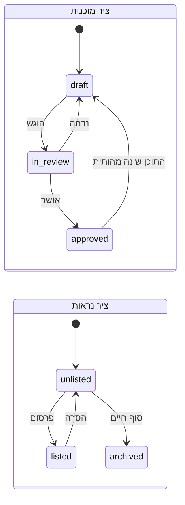

# Publication & Variant Readiness

הערכת שלוש ההחלטות המוצעות `CD-08`, `CD-09`, `CD-10` מול הקוד והסכמה בפועל.

**אין כאן שינוי קוד, שינוי סכמה, מיגרציה, עדכון נתונים או מחיקה.**

2026-09-14 · קצה פרודקשן `1a5246ea`

---

## 1. מצב קיים

| מושג | ייצוג | מצב |
|---|---|---|
| סטטוס פרסום | — | ❌ **אין.** 53 עמודות, אף אחת |
| שער פרסום | — | ❌ אין |
| אישור | — | ❌ אין `approved_by` / `approved_at` |
| דגלי סקירה | `needs_image_review`, `needs_price_review` | ⚠️ טאב סינון באדמין בלבד |
| וריאנט | 4 מנגנונים מקבילים | 🔴 אף אחד לא עובד |
| תמונות מנורמלות | `product_images` | 🔴 מתה, FK ל-`scraped_products` |
| אישור תמונה | — | ❌ `image_adopted_at` הוא העתקה, לא אישור |
| זהות וריאנט בעגלה | `variant?: string` | ⚠️ מחרוזת חופשית |

---

## 2. הערכת `CD-08` — שער פרסום

### 2.1 העיקרון — **מאושש**

מוצר מיובא נמכר ברגע ש-`createProduct` רץ. אין שער. **הצורך מוכח מהקוד.**

### 2.2 מודל המצבים המוצע — **דורש תיקון**

הצעת: `draft → in_review → approved → published → unpublished → archived`.

**הממצא: המודל מערבב שני צירים שונים.**

| ציר | מצבים בהצעה | השאלה שהוא עונה עליה |
|---|---|---|
| **מוכנות תוכן** | `draft`, `in_review`, `approved` | האם התוכן נכון? |
| **נראות בחנות** | `published`, `unpublished` | האם הוא על המדף? |
| **סוף חיים** | `archived` | — |

**למה זה חשוב:** במודל יחיד אי אפשר לבטא "מאושר אבל לא מוצג כרגע" — מוצר עונתי
שיורד מהמדף מאבד את האישור שלו, ובהחזרה צריך לגזור אותו מחדש. האישור הוא עובדה
על התוכן; הנראות היא החלטה מסחרית. הן משתנות בקצב שונה ובידי אנשים שונים.

### 2.3 התקדים בריפו תומך בהפרדה

**הזמנות כבר עושות בדיוק את זה:**

```js
const orderStatuses   = new Set(["pending","processing","shipped","delivered","cancelled"]);
const paymentStatuses = new Set(["pending","paid","failed","awaiting_cod","refunded", ...]);
```

שני צירים בלתי תלויים, כל אחד `Set` שמאומת בגבול הכתיבה. הזמנה יכולה להיות
`processing` + `paid` או `processing` + `pending` — ואף אחד לא מנסה לדחוס את
שניהם למכונה אחת.

ו-`22-STATE-MACHINES.md` כבר מעיר: *"Order — EXISTS, with three axes and only
one constrained"*.

### 2.4 המודל המומלץ — שני צירים



**כלל החיבור היחיד:** `listed` מותר **רק** כאשר המוכנות היא `approved`.
זה השער, והוא אילוץ אחד במקום שש מכונות.

### 2.5 דפוס המימוש — מהמכונה הטובה ביותר בקוד

`22-STATE-MACHINES.md` מסמן את `pet_characters` כ"best-modelled machine in the
codebase". הדפוס שלה:

- `CHECK (status IN (...))` — **אילוץ בבסיס הנתונים**, לא ביישום בלבד
- `error_code` טיפוסי לסיבת כישלון
- `generation_version` לביטול מטמון
- שחזור באתחול למצבים תקועים

**והפער המתועד שלה: אין timeout.** *"A job that hangs rather than throws leaves
the row in `generating_*` indefinitely."*

**הלקח לשער הפרסום:** ל-`in_review` חייב להיות מסלול יציאה. מוצר שהוגש ואיש לא
סקר חייב להיות ניתן לאיתור, אחרת יצרנו את אותה תקלה בדיוק במקום אחר.

### 2.6 קריטריוני מוכנות לפרסום

חובה לפני `listed`: מוכר תקף · שם · מחיר > 0 · **תמונה מאושרת** · קטגוריה ·
לפחות וריאנט אחד · SKU לכל וריאנט · מלאי מוגדר · תיאור מסחרי מאושר.

**`needs_image_review` ו-`needs_price_review` אינם אישור.** הם דגלי "שים לב",
והם יכולים להיות קלט לשער — לעולם לא תחליף לו.

### 2.7 מסקנה

**העיקרון: `CONFIRMED`. מודל המצבים: מתוקן לשני צירים.**

---

## 3. הערכת `CD-09` — זהות וריאנט

### 3.1 הצורך — **מאושש מבנית**

לא ניתן לייצג את הדוגמאות שבתדריך. `product_variations` מתה, ושורה בה מחזיקה
**זוג אחד** — "מידה S, כחול" הוא שתי שורות בלי קישור לצירוף נקנה.

### 3.2 מה האודיט **אינו** יכול להכריע

ביקשת להשאיר פתוח, וזה נכון — **הראיות אינן מכריעות:**

| שאלה | למה נשארת פתוחה |
|---|---|
| האם נדרשת טבלת Product נפרדת | תלוי אם צריך זהות משותפת בין מוכרים. `source_record_id` נותן קיבוץ חלקי בלי טבלה |
| האם לפצל את `business_products` | פיצול נוגע ב-20 אזכורים בשרת ובכל מסך אדמין |
| האם נדרשת טבלת Seller Offer | אם `business_products` **היא** ההצעה, טבלה נוספת היא ההפשטה המתחרה שאסרת |
| שורות · JSON · היברידי | ראה 3.3 |

### 3.3 ההמלצה היחידה שהראיות כן תומכות בה

**היברידי: מנורמל לזהות ולמסחר, גמיש לתיאור.**

| שדה | מנורמל? | נימוק מהקוד |
|---|---|---|
| `variant_id`, SKU, ברקוד | ✅ | זהות יציבה — `order_items` צריך להצביע עליה |
| מחיר, זמינות, מלאי, סטטוס | ✅ | צריכים אילוצים ואינדקסים. jsonb לא נותן `CHECK` |
| מאפיינים (`size`, `color`, `flavor`…) | ✅ **שורה לממד** | ריבוי ממדים דורש N שורות, לא N עמודות |
| תיאור לא-קריטי | jsonb | כמו `product_attributes` היום |

**למה שורה לכל ממד ולא עמודות:** ביקשת "מאפיינים עתידיים שרירותיים". עמודות
קבועות מחייבות מיגרציה לכל ממד חדש.

### 3.4 מסקנה

**הדרישה: `CONFIRMED`. המבנה: נשאר פתוח**, למעט העיקרון ההיברידי.

---

## 4. הערכת `CD-10` — אישור תמונות

### 4.1 חמשת המושגים — **מאוששים כנפרדים**

| מושג | קיים? |
|---|---|
| source image | ✅ `images[]`, `product_images.image_url` |
| adopted image | ✅ `image_adopted_at` — **העתקת בייטים** |
| **approved image** | ❌ **אינו קיים** |
| product image | ⚠️ מערך שטוח, בלי סיווג |
| **variant image** | ❌ אין ישות וריאנט |

**ההבחנה המרכזית מאוששת:** `adoptProductImage` מעתיק בייטים כדי שהקטלוג לא
יישבר כשספק מוחק קובץ. **הוא אינו אומר שאדם בדק.** היום כל תמונה מאומצת ואף
אחת אינה מאושרת.

### 4.2 ממצא חדש — הורדת התמונות אינה מוגנת מ-SSRF

זהו ממצא שעלה מדרישת "image URL validation" שלך.

**בריפו קיים שומר SSRF:** `urlSafety.js` — `validateRemoteHttpUrl` חוסם כתובות
IP פרטיות ושמורות, ו-`fetchValidatedRemoteUrl` עוטף אותו.

**הקוצר משתמש בו.** `productIntel.js` מאמת כל URL לפני קציר.

**`fetchImageBuffer` אינו משתמש בו:**

```js
parsed = new URL(String(imageUrl));
if (parsed.protocol !== "http:" && parsed.protocol !== "https:") throw …
response = await fetch(parsed.toString(), { signal, redirect: "follow" });
```

**רק הפרוטוקול נבדק.** אין חסימת IP פנימי, ו-`redirect: "follow"` אומר שגם
כתובת תקינה יכולה להפנות פנימה.

**החומרה — מדויקת ולא מנופחת:** הנתיב מגיע מ-`createProduct`/`updateProduct`,
שהם **מאחורי `requireAdminPermission`**. זו אינה SSRF לא מאומתת. אבל **כתובות
התמונה נאספות מ-HTML של ספק שאינו בשליטתנו** — כלומר התוכן ששולט ב-URL אינו
מהימן גם כשהיוזם הוא אדמין.

**המלצה:** `fetchImageBuffer` יעבור דרך `validateRemoteHttpUrl`. **לא בוצע** —
זהו שינוי קוד.

### 4.3 עשרת שדות המטא-דאטה

| שדה | מצב |
|---|---|
| `image_id` | ⚠️ בטבלה מתה |
| `product_id` | ⚠️ FK ל-`scraped_products` |
| `variant_id` | ❌ |
| `source_url` | ⚠️ אחד למוצר, לא לתמונה |
| `image_source` | ❌ |
| `is_primary` | ⚠️ בטבלה מתה; בצד המסחרי — מיקום במערך |
| `sort_order` | ⚠️ בטבלה מתה |
| `approval_status` | ❌ |
| `approved_at` | ⚠️ **קיים בשם, לא במשמעות** |
| `approved_by` | ❌ |

**2 מתוך 10, ושתיהן בטבלה מתה.**

### 4.4 מסקנה

**`CONFIRMED`** — חמשת המושגים נפרדים, `image_adopted_at` אינו אישור, ודרישת
אימות ה-URL נתמכת בממצא 4.2.

---

## 5. עגלה ו-checkout

| שדה | קיים? |
|---|---|
| product ID | ✅ |
| variant ID | ❌ מחרוזת חופשית |
| seller ID · offer ID · SKU | ❌ |
| price snapshot | ⚠️ קיים ו**מתעלמים ממנו בכוונה** |

**ההתעלמות ממחיר העגלה נכונה ואסור לשנותה** — `resolveCatalogOrderItem` פותר
מחיר מהקטלוג, וזה מה שמונע זיוף מחיר.

**עגלה ב-`localStorage` יכולה להיות בת שבועות.** כל שינוי מבנה חייב לקרוא
עגלות ישנות בלי לקרוס.

---

## 6. בעלות מוכר ומלאי

**בעלות:** `business_id NOT NULL` + FK — קיים ונכון. כל ישות חדשה תישא אותו
דפוס.

**מלאי:** `in_stock` בוליאני. וריאנטים הופכים את זה לחריף יותר — לכל צירוף
מלאי משלו. **ישות `inventory` נדרשת לפני שוריאנטים שמישים מסחרית.**

---

## 7. אילוצי הגירה ותאימות

| אילוץ | מצב |
|---|---|
| הזמנות היסטוריות | **בטוחות** — אין FK, הכל מצולם, אין JOIN |
| אין הפשטה מתחרה | `business_products` נשארת ההצעה |
| אין הקצאת בעלות | `defaultBusinessId` — **לא אומת שמייצג בעלות שנקבעה** |
| אין אימוץ אוטומטי | — |
| ברירת מחדל = התנהגות זהה | סטטוס ראשוני חייב לשמר את מה שנמכר היום |

---

## 8. החלטות פתוחות

| # | שאלה | מצב |
|---|---|---|
| CQ-27 | טבלת Product נפרדת? | **פתוח** |
| CQ-28 | לפצל את `business_products`? | **פתוח** |
| CQ-29 | טבלת Seller Offer נפרדת? | **פתוח** |
| CQ-30 | `product_images` — לשמש, להחליף, להגר? | **פתוח.** נטייה: להסב FK |
| CQ-31 | וריאנטים — שורות, JSON, היברידי? | **היברידי** — היחיד שהראיות תומכות בו |
| CQ-32 | האם המוצרים הקיימים ניתנים לסיווג כ-`published`? | **דורש פרודקשן** |
| CQ-33 | האם רשומות `defaultBusinessId` הן מוצרי מוכר מאושרים? | **לא אומת.** העמודה מלאה ≠ מישהו בחר |
| CQ-34 | האם עגלות מכילות ערכי וריאנט חופשיים? | **לא ניתן לדעת** — `localStorage` בדפדפני משתמשים |
| CQ-35 | האם הזמנות קיימות תלויות בזהות וריאנט? | **דורש פרודקשן** — `order_items.variant`/`size` הם מחרוזות |

**`CQ-34` ראוי לתשומת לב מיוחדת:** העגלות יושבות בדפדפנים ואין דרך לשאול אותן.
כל שינוי מבנה חייב להניח שקיים שם מידע חופשי ולהתמודד איתו בקוד.

---

## 9. קריטריוני Go / No-Go

**Go לשער הפרסום כאשר:** `CQ-32` נענתה · ברירת המחדל מוכחת כשומרת התנהגות ·
`CQ-33` הוכרעה · קריטריוני 2.6 אושרו · ל-`in_review` יש מסלול יציאה.

**Go לזהות וריאנט כאשר:** `CQ-27`–`CQ-29` הוכרעו · `inventory` תוכננה ·
`CQ-34`/`CQ-35` נענו · תאימות עגלות legacy תוכננה.

**Go לאישור תמונות כאשר:** `CQ-30` הוכרעה · ישות הווריאנט קיימת · הפרדת
אימוץ/אישור מתוכננת · אימות ה-URL (4.2) תוקן.

**No-Go מיידי לכל השלושה:** אין תוצאות פרודקשן. `PQ-1`–`PQ-4` ו-`CQ-32`,
`CQ-35` תלויות בגישה שאין.

---

## נספח — מה לא אומת

- **נתוני פרודקשן** — אין גישה.
- **תוכן עגלות** — ב-`localStorage` אצל משתמשים. לא נגיש בשום אופן.
- **שיעור התמונות השגויות בפועל** — האבחון נגזר מקריאת קוד, לא ממדידה.
