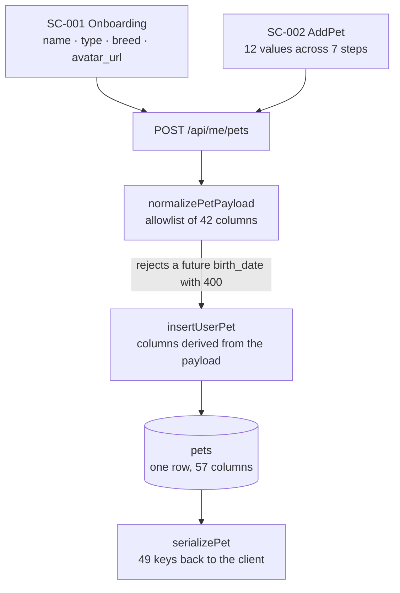
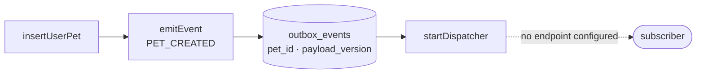
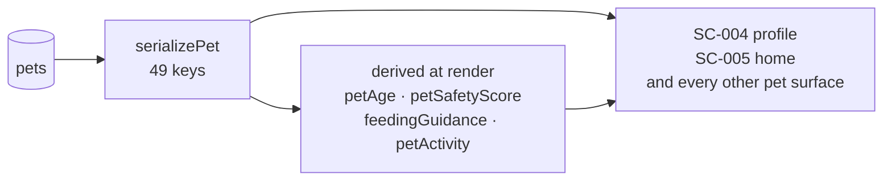
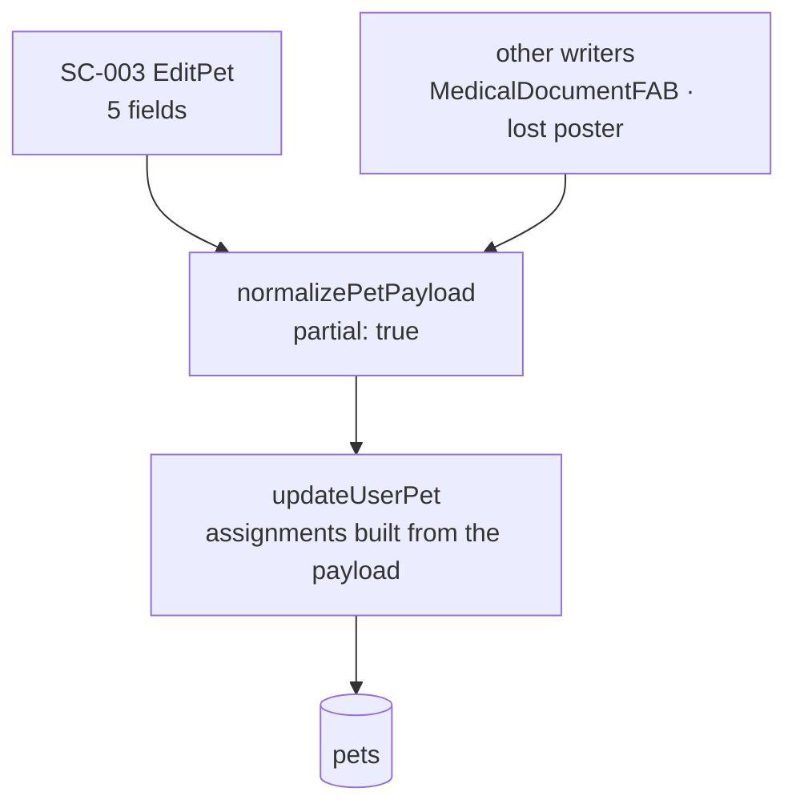
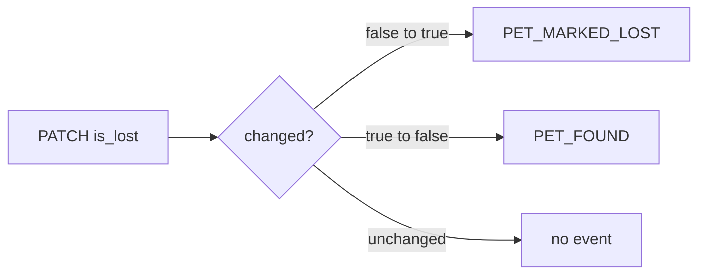
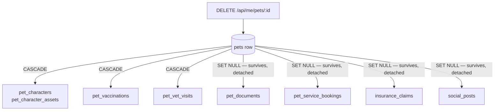
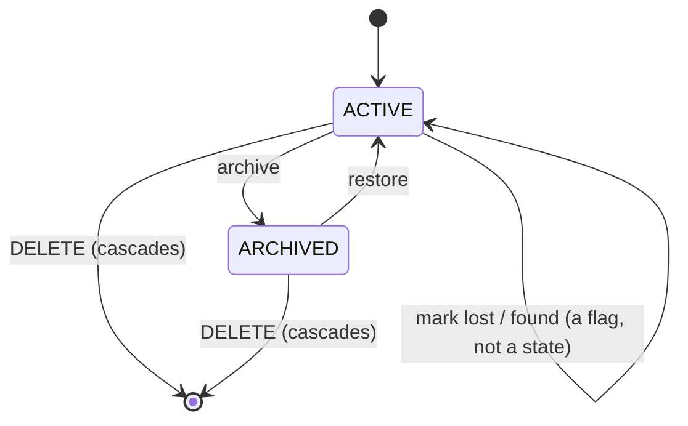

# 03 — Pet Lifecycle

**Workflows defined here:** `WF-03.1` create · `WF-03.2` read · `WF-03.3`
update · `WF-03.4` archive and delete · `WF-03.5` public view and QR scan
**Screens defined here:** `SC-004` pet profile

> **References are anchors, not line numbers.** Every `code reference` below is
> a string you can grep for. Line numbers were removed from this document after
> `f6bd559d` shifted `server/src/index.js` by seventeen lines and left every
> number in it pointing at a neighbouring line — still plausible, quietly wrong.

---

## WF-03.1 · Create a pet

**Entry screens:** `SC-001` Onboarding (4 values) · `SC-002` AddPet (12 values)
**Route:** `POST /api/me/pets` — anchor: `url.pathname === "/api/me/pets"`
**Guard:** `requireUser`

### DF-03.1a · The form to the row

`normalizePetPayload` is the only allowlist on the write side, and
`insertUserPet` derives its column list from the payload rather than repeating
it. That is what keeps the two in step — see `F-001` below for what happened
when they were not.

### DF-03.1b · The event that is recorded and never delivered

The event commits in the same transaction as the pet, so it cannot be recorded
for a pet that failed to save. Delivery is a different matter: see `F-004`.

---

## WF-03.2 · Read a pet

| Operation | Route | Guard |
|---|---|---|
| List | `GET /api/me/pets` | `requireUser`, filters `archived` |
| Read | `GET /api/me/pets/:id` | `requireUser` + `user_id` match |

Anchors: `const listUserPets`, `const getUserPet`.

### DF-03.2a · One serializer feeds every screen

Nothing in the derived layer is persisted. Age, safety score, feeding amount
and activity level are recomputed on every render from the same 49 keys, which
is why none of them can be asked about the past. `05-PET-KNOWLEDGE.md` covers
the fact layer built to answer that, and `F-005` records why it is not yet
answering anything.

Ownership is enforced by `where user_id = $1` in every query, not by a
middleware. It is applied consistently — each `requireUser` route was checked —
but it is a convention, not a mechanism. See `19-SECURITY-WORKFLOWS.md`.

---

## WF-03.3 · Update a pet

**Entry screen:** `SC-003` EditPet (5 fields)
**Route:** `PATCH /api/me/pets/:id` — anchor: `const updateUserPet`

### DF-03.3a · Partial update

`SC-003` reaches only 5 of the 42 writable columns. Everything else on a pet —
microchip, insurance, vet clinic, licensing, the lost poster — is written by
other surfaces or not at all. `56-EXISTING-PRODUCT-DATA-UX-AUDIT.md` maps which.

### DF-03.3b · The lost transition

`updateUserPet` reads `is_lost` before writing so that saving the form without
changing it emits nothing. Only a real transition produces an event.

---

## WF-03.4 · Archive and delete

Archiving sets `archived` and `archived_at` through the same update path.
Deletion is separate: `DELETE /api/me/pets/:id`, anchor `const deleteUserPet`.

### DF-03.4a · What the database decides

`deleteUserPet` is a bare
`delete from public.pets where id = $1 and user_id = $2`, plus removal of the
character image files from disk. No child rows are touched in application code,
so every consequence below comes from `pg_constraint` — read from the built
schema and then executed against it to confirm.

Confirmed empirically: inserting a user, a pet and a `pet_documents` row into
the migrated database and deleting the pet returns `DELETE 1` and leaves the
document with `pet_id = NULL`.

Status: `CONFLICTING`, and it is a real product question, not a bug report.
Deleting a pet today silently orphans that pet's medical documents, vet
bookings, insurance claims and Moments. They remain owned by the user and
readable through `GET /api/me/documents`, but nothing says which animal they
belong to any more, and nothing tells the owner that happened. Whether that is
"keep the records" or "the owner asked for it to be gone" has never been
decided. Journey P in `21-ERROR-RECOVERY.md` depends on the answer; it is
listed as a required product decision in `DECISIONS.md`.

---

## WF-03.5 · Public view and QR scan

| Operation | Route | Guard |
|---|---|---|
| Public view | `GET /api/public/pets/:id` | none, rate-limited, privacy-filtered |
| QR scan | `POST /api/public/pets/:id/qr-scan` | none, rate-limited, emits `PET_QR_SCANNED` |

Anchors: `publicPetMatch`, `publicPetScanMatch`.

This is the only pet surface reachable without a session, which makes its
privacy filter the one that matters most. `20-PRIVACY-WORKFLOWS.md` states what
it withholds.

---

## States

`DECEASED` is `MISSING` — the word appears nowhere in `src/` or `server/src/`.
Recommendation and its consequences are in `22-STATE-MACHINES.md`.

---

## The 57 columns, grouped

Read from the live schema (`information_schema.columns` after applying all 38
migrations).

**Identity** — `id`, `user_id`, `name`, `type`, `breed`, `secondary_breed`,
`is_mixed`, `breed_confidence`, `color`, `avatar_url`, `theme_color`,
`microchip_number`

**Physical** — `weight`, `weight_unit`†, `size`†, `birth_date`, `age`†,
`gender`, `is_neutered`

**Health** — `medical_conditions[]`, `health_notes`, `last_vet_visit`,
`next_vet_visit`, `current_food`

**Vet contact** — `vet_clinic`, `vet_clinic_name`, `vet_clinic_phone`,
`vet_clinic_address`, `vet_name`†, `vet_phone`† *(six columns for two facts —
see below)*

**Insurance** — `has_insurance`, `insurance_company`, `insurance_expiry_date`,
`insurance_policy_number`†

**Israeli licensing** — `is_dangerous_breed`, `license_number`†,
`license_conditions`, `license_expiry_date`, `license_renewal_date`†

**Behaviour** — `personality_tags[]`, `favorite_activities[]`, `activities[]`

**Mood** — `current_mood`†, `mood_score`†, `mood_updated_at`†

**Lost poster** — `is_lost`, `lost_since`, `lost_reward_text`,
`lost_temperament`, `lost_medication_note`, `lost_allergy_note`,
`lost_show_phone`, `lost_contact_phone`

**Lifecycle** — `archived`, `archived_at`, `created_at`, `updated_at`

† **Dead: eleven columns no path reaches.** Not accepted by
`normalizePetPayload` and not emitted by `serializePet`. Derived
programmatically from the deployed source rather than by eye — set arithmetic
over the two allowlists against `information_schema`. `age` is dead because age
is computed from `birth_date` on every read; `vet_name` and `vet_phone` because
`vet_clinic_name` and `vet_clinic_phone` superseded them; the three mood
columns because mood moved to `pet_characters`.

### Normalization problems, stated plainly

| Problem | Evidence | Consequence |
|---|---|---|
| `age` **and** `birth_date` both stored | both columns exist | `age` is stale the day after it is written; two sources for one fact |
| Vet contact spread over 6 columns | `vet_clinic`, `vet_clinic_name`, `vet_clinic_phone`, `vet_clinic_address`, `vet_name`, `vet_phone` | No single clinic entity; `vet_clinic` vs `vet_clinic_name` is ambiguous |
| Three overlapping activity arrays | `personality_tags`, `favorite_activities`, `activities` | Unclear which is canonical |
| `weight` is scalar | one column | No weight trend, which is the single most useful health signal a pet app has |
| `current_mood` is scalar | `mood_score`, `mood_updated_at` | Mood history is overwritten |
| No provenance on any column | — | See `05-PET-KNOWLEDGE.md` |
| `size` stored, not derived | `pets.size` | Drifts from `weight` and `breed` |

None of these are urgent bugs. All of them are why a Pet 360 model cannot be
layered on `pets` without a companion facts table.

---

## Field classification

Format: `field → provenance class (as the brief defines them)`. **The `pets`
table still stores none of these classes.** The fact layer that does is built
and deployed but has no writers — see `F-005`.

| Field | Type | Req | Target provenance | Editable | Historical? | Derived? |
|---|---|---|---|---|---|---|
| `name` | text | ✓ | USER_PROVIDED | ✓ | no | no |
| `type` | text (CHECK) | ✓ | USER_PROVIDED | ✓ | no | no |
| `breed` | text | | USER_PROVIDED / AI_INFERRED | ✓ | no | no |
| `breed_confidence` | int | | AI_INFERRED | system | no | ✓ |
| `birth_date` | date | | USER_PROVIDED / VET_DOCUMENT | ✓ | no | no |
| `age` | int | | **SYSTEM_DERIVED** | should not be stored | no | ✓ |
| life stage | *missing* | | SYSTEM_DERIVED | — | no | ✓ |
| `weight` | numeric | | USER_PROVIDED / VET_CONFIRMED | ✓ | **should be** | no |
| `size` | text | | SYSTEM_DERIVED | dead column | no | ✓ |
| `gender` | text | | USER_PROVIDED | ✓ | no | no |
| `is_neutered` | bool | | USER_PROVIDED / VET_DOCUMENT | ✓ | ✓ (has a date) | no |
| `medical_conditions[]` | text[] | | VET_DOCUMENT / USER_PROVIDED | ✓ | **should be** | no |
| allergies | *missing* | | VET_DOCUMENT / USER_PROVIDED | — | ✓ | no |
| `current_food` | text | | USER_PROVIDED / PURCHASE_DERIVED | ✓ | ✓ | no |
| activity level | *missing* | | ACTIVITY_DERIVED | — | ✓ | ✓ |
| preferences | *missing* | | PURCHASE_DERIVED / USER_PROVIDED | — | ✓ | ✓ |
| `microchip_number` | text | | USER_PROVIDED | ✓ | no | no |
| `is_lost` | bool | | USER_PROVIDED | ✓ | ✓ (`lost_since`) | no |

Privacy classification for each of these is in `20-PRIVACY-WORKFLOWS.md`.

---

## Findings

| ID | Workflow | Finding | Status |
|---|---|---|---|
| `F-001` | WF-03.1 | Create accepted 42 columns and wrote 19, dropping 23 — microchip, vet clinic, insurance, licensing, the whole lost poster — while answering 201 | **Closed** in `f6bd559d`. `insertUserPet` now derives its columns from the payload |
| `F-002` | WF-03.1 | A birth date in the future was stored, making age negative and poisoning life stage, feeding portion and preventive care | **Closed** in `f6bd559d`. Rejected with 400, bounded at tomorrow in UTC so a date-only "today" is still valid east of UTC |
| `F-003` | WF-03.1, WF-03.3 | Both pet forms initialised `is_neutered` to `"false"`, recording an answer the owner never gave; `SC-003` also collapsed a null column to "no" on load | **Closed** in `f6bd559d`. Unknown stays null through both forms |
| `F-004` | WF-03.1 | `PET_CREATED` and every other pet event is recorded and never delivered: `AUTOMATION_WEBHOOK_URL` is in neither key list in `deploy/aws/sync-ssm-env.sh`, and `startDispatcher` returns a no-op without it | **Open.** Nothing is lost — events accumulate and will be delivered once the variable is set |
| `F-005` | WF-03.2 | The fact layer is deployed and has no writers: the only callers of `writeFact` and `recordObservation` are the two API routes themselves. Creating a pet, scanning a document and updating weight all write zero facts | **Open.** This is the DUAL WRITE stage, not yet started |
| `F-006` | WF-03.4 | Deleting a pet orphans its documents, bookings, claims and Moments with no notice to the owner | **Open — product decision**, see `DECISIONS.md` |
